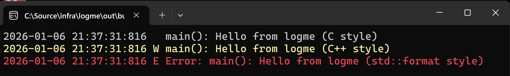

# logme

[](https://github.com/efmsoft/logme/actions/workflows/ci.yml)
[](https://github.com/efmsoft/logme/releases)


[](https://github.com/efmsoft/logme/wiki)

[](https://vcpkg.io/en/package/logme)
[](https://conan.io/center/recipes/logme)


**logme** is a cross-platform C/C++ logging framework that allows applications to dynamically control what is logged and where, without restarting or recompiling.

It is designed for both high-load servers and simple applications, providing selective, on-demand logging with minimal overhead and full runtime control.

- 📚 **Documentation (Wiki):** https://github.com/efmsoft/logme/wiki
- 💬 **Support / feedback:** [GitHub issues](https://github.com/efmsoft/logme/issues) and [discussions](https://github.com/efmsoft/logme/discussions) are welcome.

---

## Key features

- **Runtime control** via a built-in control server: enable, disable, and reconfigure logging dynamically without restarting or recompiling the application.
- **Channels and subsystems**: logically separate log output by component, module, or functional area.
- **Hierarchical channels**: build structured logging trees and control groups of components together.
- **Flexible verbosity control**: fine-grained filtering using log levels (Debug / Info / Warn / Error), subsystems, and channel hierarchy.
- **Multiple backends per channel**: console, debugger, files, and other output destinations.
- **Channel links**: redirect or fan-out log messages between channels without duplicating backend configuration.
- **Retention rules**: limit the size of individual log files and the total disk usage across all logs.
- **Log file obfuscation**: optional obfuscation of log data written to files.
- **Multiple APIs**: C-style macros, C++ stream-style logging, and optional `std::format`-based formatting.
- **Cross-platform**: Windows, Linux and macOS support.

---

## Quick start

### Minimal usage (out of the box)

The simplest possible usage. This works **out of the box** and requires no configuration.

```cpp
#include <Logme/Logme.h>

int main()
{
  LogmeI("Hello from logme (%s style)", "C");
  LogmeW() << "Hello from logme (C++ stream style)";
  fLogmeE("Hello from logme ({} style)", "std::format");

  return 0;
}
```

This produces colored console output similar to the following:



---

## Configuration files (recommended)

For most applications, logme is configured via a JSON configuration file, which can describe the following elements:

- channels
- backends
- links
- levels
- flags
- subsystems

This lets you adjust logging behavior at runtime or between runs without recompiling.

For details and examples, see the project [Wiki](https://github.com/efmsoft/logme/wiki/Configuration-JSON).

---

### Programmatic configuration (advanced)

All aspects of logme behavior can be configured directly from C++ application code. This approach is useful for small tools, embedded scenarios, or when configuration files are not desired.
```cpp
#include <memory>

#include <Logme/Logme.h>
#include <Logme/Backend/ConsoleBackend.h>

int main()
{
  auto ch = Logme::Instance->CreateChannel("http");
  ch->AddBackend(std::make_shared<Logme::ConsoleBackend>(ch));

  fLogmeI(ch, "GET {} -> {}", "/index.html", 200); // -> GET /index.html -> 200
  return 0;
}
```

---

## Runtime control (built-in control server)

Applications using **logme** can optionally enable a **built-in control server** that allows logging behavior to be **fully managed at runtime**.

The control server exposes a management interface for:

- creating and removing channels,
- attaching or detaching backends,
- enabling, disabling, or blocking channels,
- controlling subsystems, levels, and routing.

A command-line utility is provided with the library to send control commands to a running process, but the **specific tool is not important** — the key point is that logging can be **reconfigured dynamically while the application is running**.

### Why this matters

A common use case is a modular application where each component writes to its own channel.

At startup:
- channels may **not exist at all**,
- messages sent to non-existent or inactive channels are **silently dropped**,
- no log files are created,
- no console output is produced.

When diagnostics are required:
- a channel can be **created remotely**,
- backends can be attached (file, console, debugger),
- messages from the selected component immediately start appearing.

Later:
- the channel can be removed,
- blocked,
- or detached from all backends,
- instantly stopping further output.

### Result

This model allows **selective, on-demand logging**:

- only for specific components,
- only when needed,
- only to selected destinations.

It keeps production systems quiet by default while still allowing **deep, targeted diagnostics** without restarting the application or recompiling it.

---

## Concepts

### Channel

A **channel** is where you write messages. A channel can have:

- one or more **backends** (output destinations),
- optional **links** to other channels (redirect / fan-out).

### Backend

A **backend** defines where messages go (console, debugger, file, etc.).
Multiple backends can be attached to the same channel.

### Subsystem

A **subsystem** is an optional identifier that provides an additional level of classification inside a channel.
Subsystems allow grouping and filtering messages within the same channel, making it possible to enable or disable logging for specific functional parts of a component without affecting the entire channel.

### Link (redirect)

A **link** forwards messages from one channel to another after local backends are processed.
This is useful for building routing trees (e.g., `http` → `root`).

---

## Installation

### Option A: CMake FetchContent

```cmake
include(FetchContent)

FetchContent_Declare(
  logme
  GIT_REPOSITORY https://github.com/efmsoft/logme.git
  GIT_TAG        main  # Prefer a release tag when available
)

FetchContent_MakeAvailable(logme)

target_link_libraries(your_target PRIVATE logme)
```

### Option B: Add as a subdirectory

```cmake
add_subdirectory(external/logme)

target_link_libraries(your_target PRIVATE logme)
```
An example of integrating logme as a git submodule can be found here: https://github.com/efmsoft/logme_cmake_submodule_example

---
### Option C: vcpkg

```bash
vcpkg install logme
```

```cmake
find_package(logme CONFIG REQUIRED)
target_link_libraries(your_target PRIVATE logme::logme)
```

---

### Option D: Conan

```bash
conan install --requires=logme/<version>
```

```cmake
find_package(logme REQUIRED)
target_link_libraries(your_target PRIVATE logme::logme)
```

---


## Build

### Configure and build

```bash
cmake -S . -B build
cmake --build build
```

### Tests

```bash
cmake -S . -B build -DLOGME_BUILD_TESTS=ON
cmake --build build
ctest --test-dir build
```

---

## CMake options

- `LOGME_BUILD_EXAMPLES` (ON/OFF)
- `LOGME_BUILD_TESTS` (ON/OFF)
- `LOGME_BUILD_STATIC` (ON/OFF)
- `LOGME_BUILD_DYNAMIC` (ON/OFF)
- `LOGME_STD_FORMAT` (`AUTO`, `ON`, `OFF`)

---

## Requirements and compatibility

### Language standard

- C++20 is used.

### `std::format` support

`std::format` is optional. If your standard library does not provide `<format>`, disable it via:

- `-DLOGME_STD_FORMAT=OFF` (or define `LOGME_DISABLE_STD_FORMAT`)

---

## Roadmap

- More backends and routing presets
- Improved documentation and more integration examples

---

## Contributing

Contributions are welcome via issues and pull requests.

Please include:
- OS and compiler version,
- CMake options used,
- minimal reproduction steps if applicable.

---

## License

See the `LICENSE` file.

