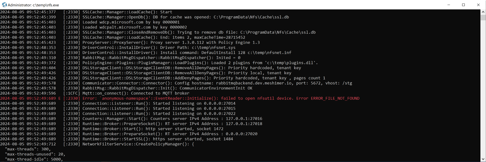

# logme library
Compact cross-platform logging framework for C &amp; C++. Implements the concept of Channels. Supports dynamic creation of Channels, modifying channel configuration, messages redirection. Supports logging to console, files on disk, buffer, debugger window, VT100 message highlighting.



# Table of Contents
1. [Introduction](#introduction)
2. [Compatibility & Build](#compatibility--build)
3. [Logging macros](#logging-macros)
4. [Default configuration](#default-configuration)
5. [Output flags](#output-flags)
6. [Thread Channel](#thread-channel)
7. [Integration with AllStat](#integration-with-allstat)

## Introduction <a name="introduction"></a>
It would seem that what could be simpler than logging? And indeed, for small projects it is enough to have code that, for example, uses **printf** to output messages to the console, or writes messages to a file using **fprintf**. But this is not enough in large projects. These projects are usually cross-platform, have many subsystems, and require high performance from the logging system.

Generally speaking, when creating a logging system in a project, there is always a struggle between two extremes: 1) nothing is logged and if the system fails, it is not clear what happened 2) logging is too detailed and it is very difficult to find the necessary information in hundreds and thousands of log lines.

One of the ideas for creating this library was to solve the problem mentioned above. This was done by introducing the concept of **Channel**. A **Channel** is a named object to which **Backends** are attached. **Backend** is a transport for writing data (for example, to the console or to a file on disk). Thus, using a macro for writing to a log and a channel specified, you can ensure that a message is output to several places at once. But the most important thing when using channels is that each of your project's subsystems can use output to its own channel. And then at the configuration level on disk or dynamically, channels can be turned on/off, redirected output.

For example, there are two subsystems **A** and **B**. Modules **A** write detailed work about their work to channel **A**. Modules **B** to channel **B**. At the application initialization stage, only channel **A** was created and the filtering level allowed writing to the log only error messages

**A.cpp**:
```cpp
Logme::ID A{"A"};

void initialize()
{
  LogmeI(A, "starting initialization");
  int r = DoSomething();
  if (r <= 0)
  {
    LogmeE(A, "DoSomething() failed. Error: %i", r);
  }

  LogmeI(A) << "you can also use c++ symantec: " << r;
}
```

**B.cpp**:
```cpp
Logme::ID B{"any_name"};

int DoSomething()
{
  LogmeE(B, "not impemented");
  return -1;
}
```
Then the log will only contain the error message "DoSomething() failed...". Having seen it, you can change the filtering level and get all messages written to channel **A**. Or create channel **B** in search of the reason why **DoSomething** returned an error.

Channels can be created, deleted, enabled, the filtering level can be changed, and they can be redirected to other channels. The latter can be very useful if, for example, your project has a central log that collects all messages (or only errors from all subsystems) and separate logs with messages about the operation of subsystems. Then, by linking the subsystem channel to the central log channel, you can write to the subsystem channel and at the same time duplicate everything in the central channel.

## Compatibility & Build
The library uses the C++ 20 standard and can be built for **Windows**, **Linux** and **MacOS**. **CMake** is used for building. For **Windows**, there are also .sln files for **Visual Studio 2022**

The library does not use additional libraries. There is an optional ability to use the allstat library to print extended error information. The **gtest** library is used to build tests

## Logging macros

To start using the library, simply include the **Logme/Logme.h** file and call one of the following macros: **LogmeD()**, **LogmeI()**, **LogmeW()**, **LogmeE()**, **LogmeC()**. The last letter in the macro name defines the level/type of the message: **D** - debug, **I** - information (usually the most frequently used type), **W** - warning, **E** - error, **C** - critical error. Each of these macros takes a variable number of arguments. They can define the name of the channel to which the record should be made, as well as **Override** parameters, format string, substitution parameters.

Examples of use:
```cpp
#include <Logme/Logme.h>

...
Logme::ID ch{"test"};
...

// Use default channel
LogmeW("Hello %s", "World!");
LogmeI() << "C++ style of " << "output";

// Specify channel explicitly LogmeI(ch, "output to ch");
LogmeD(ch) << "something" << 123;

// Specify both channels and override Logme::Override ovr;
ovr.Remove.Method = false;
LogmeC(ch, ovr, "something went wrong");
```

## Default configuration

As mentioned above, to start using the library you only need to add inclusion of **Logme/Logme.h**. You can log messages right after that. This uses the default configuration, which creates a default channel (the variable for it is defined as global and is always available as ::CH). Backends are added to the default channel depending on whether it is a debug or release build. In both cases, a backend is added for output to the console. In the case of a debug build for **Windows**, a backend is also added for outputting messages to the **Output window** of the debugger.

In many cases, this configuration is enough for work. If changes are required, they can be easily made in the initialization code. For example, like this:

```cpp
#include <Logme/Logme.h>
#include <Logme/Backend/FileBackend.h>

...

// Add a record of logged messages to a file
auto ch = Logme::Instance->GetExistingChannel(CH);
auto backend = std::make_shared<FileBackend>(ch);
if (backend->CreateLog("logfile.log")) 
  ch->AddBackend(backend);
```

Any aspect of the configuration can be changed from the code. But a simpler solution is to use a configuration file. An example of such a file and the code for loading it is given below.

**main.cpp**:

```cpp
#include <Logme/Logme.h>
...
// Config file can contain references to environment variables. In the
// config.json we are using ROOT_LOG variable to set name of log file.
// In the lines below we are defining ROOT_LOG
time_t now = time(nullptr);

struct tm tstruct;
#ifdef _WIN32
localtime_s(&tstruct, &now);
#else
localtime_r(&now, &tstruct);
#endif  

char buf[80];
strftime(buf, sizeof(buf), "%Y-%m-%d.%X", &tstruct);
Logme::EnvSetVar("RDS_LOG", buf);

// Load configuration from "logger" section of config file
Logme::Instance->LoadConfigurationFile("config.json", "logger");
```

**config.json**:
```json
{
  "my__app__option1": 1,
  "any_other_values": {
  },
  "logger": {
    "flags": {
      "default": {
        "Timestamp": "local",
        "Signature": true,
        "Method": true,
        "ErrorPrefix": true,
        "ThreadID": true,
        "Highlight": true,
        "eol": true
      }
    },
    "channels": [
      {
        "name": "",
        "level": "info",
        "flags": "default",
        "backends": [
          {
            "type": "ConsoleBackend",
            "build": "any"
          },
          {
            "type": "FileBackend",
            "append": true,
            "max-size": 134217728,
            "file": "{%ROOT_LOG}"
          }
        ]
      }
    ]
  }
}
```

## Output flags
For each channel, Output Flags are set. These flags determine the format of messages that are sent to the log. In particular, these flags determine the format of the timestamp, include the addition of the name of the method in which the macro was called for output to the log, and whether or not line feed characters are added automatically.

The **OutputFlags** structure is used to set the flags. It can be specified as a parameter when creating a channel. You can also change the flags for an already created channel by calling its **SetFlags()** method.

In some cases, you do not want to change the flags on a permanent basis and you only need to change the flags for one or several messages. In this case, it is convenient to use **Override**.

In the example below, a channel is created with an explicitly specified set of flags. Then changes are made to the set of flags. And at the end of the example, output to the log occurs using **Override**.

```cpp
OutputFlags flags;
flsgs.Eol = false;

Logme::ID newch{"newch"};
auto ch = Logme::Instance->CreateChannel(newch, flags);

ch->AddLink(CH);
LogmeI(newch, "some message with eol\n");

flags.ErrorPrefix = true;
ch->SetFlags(flags);

Logme::Override ovr;
ovr.Remove.Eol = true;
LogmeI(newch, ovr, "message w/o eol");
```

Each of the bit groups in **OutputFlags** enables or disables adding information to the lines output to the log. Below is an overview of what can be enabled in the log lines. The location of each of the flag-controlled groups is shown in the diagram below

<**Timestamp**><**Signature**>[<**ProcessId**>:<**ThreadId**>]<**Channel**><**Location**><**ErrorPrefix**><**Method**><**Message**><**Eol**>

#### Timestamp
Enables or disables adding a timestamp. If the parameter is set to **TIME_FORMAT_NONE**, the timestamp is not added. By specifying **TIME_FORMAT_LOCAL**, **TIME_FORMAT_TZ**, **TIME_FORMAT_UTC** you can select the timestamp format.

#### Signature
The signature is an uppercase character indicating the message level (debug message - **D**, information, warning - **W**, error - **E**, critical error - **C**). For information messages, the character is not specified.

#### ProcessId
If the flag is enabled, the current process ID is specified in the corresponding field as a hexadecimal number

#### ThreadId
If the flag is enabled, the current thread ID is specified in the corresponding field as a hexadecimal number. If neither **ProcessId** nor **ThreadId** are enabled, then square brackets are not added to the log. A colon is printed in any case if **ThreadId** display is enabled

#### Channel
The name of the channel to which the message was sent is added to the log. The channel name is enclosed in curly brackets

#### Location
If the value is set to **DETALITY_NONE** (this is the default value), then information about the module is not added. Depending on **DETALITY_SHORT** or **DETALITY_FULL**, either only the module name with the extension or a line with the full path to the module is added to the log. The line number is added in parentheses after the mindle name. The location information is terminated by a colon

#### ErrorPrefix
If this information type is enabled, then **"Error: "** or **"Critical Error: "** is added to error messages. By default, this information type is disabled

#### Method
If adding this information is enabled (by default), then the name of the function that issued the message to the log is also printed to the log. This is the function name in short form, followed by parentheses and a final colon

#### Message
This is the actual text of the message output to the log. Always enabled

#### Eol
If enabled (by default), a line feed is added to the line output to the log - '**\n**'

**Default flag value**:
Timestamp: **TIME_FORMAT_LOCAL**  
Signature: **true**  
ProcessId: false  
ThreadId: false  
Channel: false  
Location: false  
ErrorPrefix: **true**  
Method: **true**  
Eol: **true**  

#### Control flags
Some flags have special meanings.

The **Highlight** flag enables color highlighting when outputting to the console. Errors are highlighted in red, warnings in yellow, and debug messages in gray. Color highlighting is enabled by default.

The **Duration**, **ProcPrint**, and **ProcPrintIn** flags are set automatically if the LogmeP() macro is used to print the execution time of functions. You should not change them manually

The **DisableLink** flag can be used to temporarily disable redirection to a linked channel. This is usually done using **Override**

The **Console** flag defines the stream to which messages are output when printing in the console backend. By default, the **STREAM_ALL2COUT** value is used and everything printed to the console is written to **stdout**. In the case of the **STREAM_WARNCERR** value, messages starting with the **Warning** level (**warning**, **error**, **critical error**) are printed to **stderr**. Similarly, for **STREAM_ERRCERR**, all messages starting with an error are printed to **stderr**. In the case of **STREAM_ALL2CERR**, all messages are written to **stderr**

## Thread Channel
There are situations when the channel name cannot (or cannot be) passed to the called code. But at the same time, you want the messages to go to the desired log.

For example, there is a subsystem that writes messages to channel A. At some point in time, the subsystem code calls a shared library. The library does not know who called it and where the messages need to be written. In this case, setting a channel for a thread is a good option. If the channel is set for a thread, then all calls to the macro for writing to the log without explicitly specifying the channel name will go to the **Thread Channel**. To set a channel for a thread, you can use the **LogmeThreadChannel(A)** macro. This macro creates a temporary object whose demstructor will return the **Thread Channel** that was set before.

```cpp
#include <Logme/Logme.h>

void myfunc()
{
  LogmeThreadChannel(A);
  
  func2();
}

void func2()
{
  LogmeI("this message will be written to A");
}
```

## Integration with AllStat
The **logme** has built-in integration with the **AllStat** library. If **AllStat** is connected to the project and **USE_ALLSTAT** is declared, the **OSERR**(e) and **OSERR2** macros are defined. They can be used as parameters in a LogmeX macro call to print the error code mnemonic. In the case of calling **OSERR**, the error code must be specified as a parameter. The **OSERR2** macro itself gets the error code using the default method for the current operating system (from **errno** or by calling **GetLastError**())

The example below prints an error message that specifies not the error code, but its name defined in **winerror.h**

```cpp
#include <windows.h>
#include <Logme/Logme.h>

int main(int argc, char* argv[])
{
  HANDLE h = CreateFileA(
    "non-existent file"
	, GENERIC_READ
	, FILE_SHARE_READ
	, nullptr
	, OPEN_EXISTING
	, 0
	, nullptr
  );
  if (h == INVALID_HANDLE_VALUE)
  {
    LogmeE("Unable to open file. Error: %s", OSERR2);
  }
  return 1;
}
```
Running this code will print the following error message:


